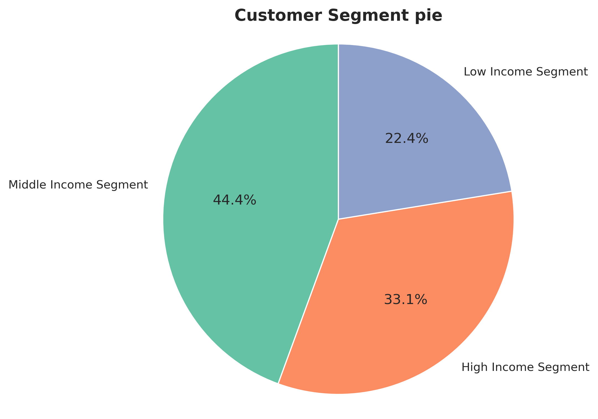
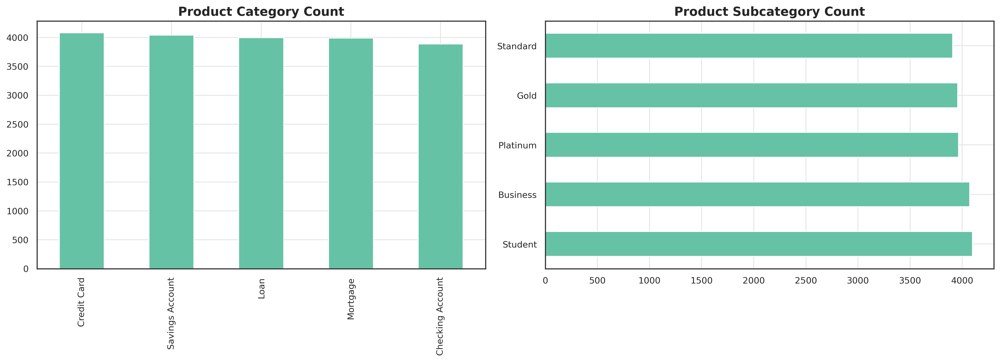
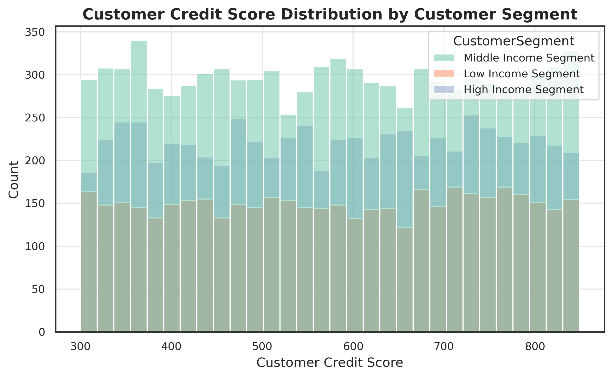

# Bank Data Analysis

## Customer Insights and Segmentation Analysis

The purpose behind this project was to analyze a customer transaction data for a bank, to help them discover spending patterns and behaviour of their customers

## Objective

The primary objective for the analysis is to discover insights that the bank would use to:

- personalize products and services for their customers
- Refine marketing campaigns for targeted marketing
- and increase customer base

and to give proffesional recommendations

## Analysis and Insights

My analysis was split on analyzing

- customer segmentation
- Spending pattern on the bank products and
- Credit Score effects on spending pattern

`Technical analysis and details in the .ipynb file`